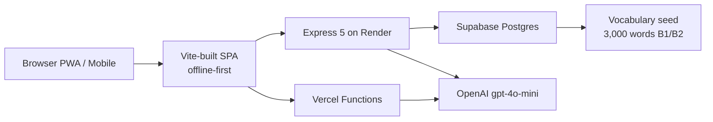

# Koto Lift

> A mobile-first, offline-capable PWA for language learning — built with React, TypeScript, Supabase, and OpenAI.

**Live:** https://sumi.sumidev.com
**Stack:** React 19 · TypeScript · Vite · Node/Express 5 · Supabase Postgres · OpenAI gpt-4o-mini

---

## Why I built it

Built for my partner, a native Japanese speaker learning English. I wanted a single app that combined bidirectional spaced-repetition flashcards, an LLM tutor that explains any sentence on demand, and offline-first storage that worked on a phone — and I couldn't find one. Spanish was added later because the architecture scaled cleanly to a third language, but the core use case is Japanese → English.

---

<!-- TODO: capture and embed 3-4 screens: Review, Drill, Explain, Add Card. -->

---

## Features

### Core learning
- **Bidirectional 3-language flashcards** (Japanese, English, Spanish) with per-direction spaced repetition
- **SM-2 scheduler with ease factor + fuzz** for natural review intervals
- **Drill mode** for casual practice outside the review queue
- **Searchable card library** with tag + deck organization
- **Vocabulary seed** of 3,000+ B1/B2 words with frequency ranking and conjugations

### AI-powered (OpenAI gpt-4o-mini)
- **Explain Sentence**: translations, grammar points, vocabulary, alternatives, mistakes, naturalness score — in a single structured-output call
- **Examples generator** with sense disambiguation, producing 3 short usage examples in the user's intended meaning (e.g. "commitment" as promise/obligation, not "committed" as suicide)
- **One-click "Add as Card"** for any explained example, with auto-detected source language
- **Regenerate button** to re-roll the examples with explicit "do not repeat" prompting

### Cross-platform
- **PWA with service worker** — install to phone home screen, works offline
- **Offline-first storage** in IndexedDB (Dexie); the SRS scheduler and review queue never leave the device
- **Supabase cloud sync** for cross-device cards, user accounts, and per-user vocab

### Quality-of-life
- **TTS with retry chain** for short-Japanese strings (handles OpenAI's documented short-string clipping)
- **3-language audio control** on every card with smart voice fallback
- **Per-user settings** synced via Supabase, with localStorage fallback for migration

---

## Tech stack

| Layer | Choice | Why |
|---|---|---|
| Frontend | Vite + React 19 + TypeScript | Vite for fast HMR; React 19 for Suspense/transitions; TS to keep the data model honest |
| State / Storage | Dexie (IndexedDB) | Offline-first requirement; relational queries on the client keep the SRS scheduler local and snappy |
| UI motion | Framer Motion | Accordion/transition choreography without a state machine |
| Backend | Node + Express 5 on Render | Familiar patterns, easy local dev, plays well with Supabase service-role auth |
| Edge functions | Vercel Functions | Same code path for `POST /api/explain` and `POST /api/regenerate-examples` deployable to both Vercel and Render |
| Database | Supabase Postgres | RLS policies for per-user data isolation; direct `pg` connection for seed scripts |
| AI | OpenAI gpt-4o-mini | Structured JSON outputs, cheap enough to run on every Explain click, no fine-tuning needed |
| TTS | OpenAI tts-1 | Voice chain + pause-prefix retry handles the documented short-string clipping bug |
| Auth | JWT (jose) + bcrypt + OAuth | Standard stack; service-role keys never reach the client |
| Build | TypeScript, ESLint, Vitest | Strict TS throughout, configured lint, test scaffold ready |

---

## Architecture



The SPA works offline against IndexedDB. When online, it talks to two backend surfaces:

- **Render (Express 5)** — auth, flashcards, video, TTS, transcribe, explain, regenerate-examples
- **Vercel Functions** — the LLM-only endpoints (`/api/explain`, `/api/regenerate-examples`) for low-latency edge deploy

Both call the same OpenAI integration and the same Supabase DB.

---

## Notable engineering decisions

### TTS retry chain for short Japanese strings

OpenAI's `tts-1` model clips or returns silent audio for 1–2 kana inputs. Solved with a voice walk (`alloy → shimmer → onyx → nova`) plus a `… ` pause prefix as last resort. The winning voice is exposed in the `X-TTS-Source` response header for production debugging, and the cache key is derived from the actual `voice` that succeeded so retries don't re-hit the API.

### Sense disambiguation in example generation

First attempt at usage examples used the Tatoeba public corpus. "commitment" returned three sentences about suicide — Tatoeba's relevance search doesn't understand the user's intended meaning. Switched to LLM-generated examples with an explicit prompt rule: *"use the input word in the user's INTENDED meaning (e.g. commitment as promise/obligation, not committed as suicide)"*. Sense-aware generation beats corpus search for this use case.

### Bidirectional SRS with auto direction inference

`ensureReviewStates(card)` walks the source/target language pairs and creates review-state rows for every valid direction (e.g. `ja→en`, `en→ja`, `ja→es`, `es→ja`). Lets the user mix review directions without manual setup, and keeps the scheduler's read pattern simple — one query per direction.

### Per-user isolation via Supabase RLS + service-role pattern

`user_id` is always injected server-side; the service-role key never reaches the browser. The same Express route works for "own cards" and "admin" via per-request auth check. RLS policies on the tables enforce isolation at the DB layer as a second line of defense.

### Deployment portability

The `api/` folder (Vercel Functions) and `server/` folder (Render Express) call the same helpers but with separate copies because their build roots don't overlap. The trade-off (some code duplication) is documented in the helper comments and accepted in exchange for the simpler deploy story.

---

## Quick start

### Prerequisites

- Node.js 22+
- npm 10+
- Docker (optional, for the containerized path)
- An OpenAI API key — https://platform.openai.com/settings
- A Supabase project (free tier works) — https://supabase.com

### Local development (no Docker)

```bash
git clone https://github.com/sumilover/koto-lift
cd koto-lift
cp .env.example .env
# fill in OPENAI_API_KEY and Supabase keys
npm install
cd server && npm install && cd ..
npm run dev   # runs Vite + Express together
```

Open http://localhost:5173 in your browser.

### Containerized (one command)

```bash
git clone https://github.com/sumilover/koto-lift
cd koto-lift
cp .env.example .env
# fill in OPENAI_API_KEY and Supabase keys
docker compose up -d --build
```

Open http://localhost:7000 when the containers are healthy.

### Build for production

```bash
npm run build      # builds the Vite SPA
cd server && npm run build && cd ..
```

---

## Environment variables

| Variable | Required | Description |
|---|---|---|
| `OPENAI_API_KEY` | Yes | Powers Explain, Examples, and TTS. Get one at https://platform.openai.com/settings |
| `VITE_API_BASE` | No | Backend base URL. Defaults to `https://kotolift.onrender.com` |
| `VITE_EXPLAIN_API_URL` | No | Override for the Explain endpoint (e.g. a Vercel worker URL) |
| `SUPABASE_URL` | Yes (for sync) | Project URL from Supabase dashboard |
| `SUPABASE_SERVICE_ROLE_KEY` | Yes (server-side only) | Service-role key, never exposed to the browser |
| `PG_HOST` / `PG_PORT` / `PG_USER` / `PG_PASSWORD` / `PG_DATABASE` | Yes (server-side) | Direct Postgres connection for the seed script |
| `GOOGLE_CLIENT_ID` / `GOOGLE_CLIENT_SECRET` / `GOOGLE_REDIRECT_URI` | No | Google OAuth credentials for sign-in |
| `APP_URL` | No | Frontend public URL. Defaults to `https://sumi.sumidev.com` |
| `YOUTUBE_COOKIES` | No | Optional. Cookies file content for YouTube transcript scraping on rate-limited networks |

---

## Project structure

```
src/
  components/        # 30 screens + UI primitives
                     #   (Accordion, AudioControls, SentencePanel, WordTooltip, ...)
  services/          # API + business logic
                     #   review.ts (SM-2 scheduler), cards.ts, auth.ts, settings.ts, ...
  db/                # Dexie schemas
  types/             # TypeScript interfaces
  hooks/             # Shared React hooks
  utils/             # explainAdapter, helpers

server/              # Express 5 backend (Render)
  src/
    routes/          # 14 route files: auth, tts, explain, video,
                     #   flashcards, transcript, transcribe, ...
    services/        # auth, business logic
    middleware/

api/                 # Vercel Functions (serverless)
  explain/           # POST /api/explain
  regenerate-examples/  # POST /api/regenerate-examples
  auth/              # Google OAuth callback
  video/             # Video analysis (serverless variant)
  usage/             # Per-user rate-limit / usage

public/              # PWA assets (manifest, service worker, icons)

Dockerfile           # Single-image build that ships the SPA + the Express server
docker-compose.yml   # Local + Render deploy
vercel.json          # Vercel function config
```

---

## Testing & quality

- **TypeScript throughout** with strict mode in both `tsconfig.app.json` (frontend) and `server/tsconfig.json` (backend)
- **ESLint** configured for React Hooks + refresh rules
- **Vitest** scaffolded (`npm test` runs with `--passWithNoTests`)
- **CORS** configured on the Express server to allow the Vercel-hosted explain endpoint to be called from any origin

---

## Deployment

### Render (the persistent backend)

The full app + the Express server ship as a single Docker image. `Dockerfile` builds the Vite SPA and the Express server in one image; Render deploys it on push to `main`. The image bundles `yt-dlp` for YouTube content extraction.

### Vercel (the LLM endpoints)

`api/explain/index.ts` and `api/regenerate-examples/index.ts` deploy as Vercel Functions, providing low-latency edge access to the OpenAI calls. The SPA can be configured to hit either endpoint via `VITE_EXPLAIN_API_URL`.

---

## Roadmap

- [ ] **YouTube-based learning with synced subtitles, word tooltips, and click-to-translate** (in active development — pivoting to a YouTube IFrame embed + overlay layer to avoid CORS, DRM, and ToS issues with self-hosted video playback)
- [ ] **Self-hosted LLM** (Ollama) for fully offline Explain
- [ ] **Voice-input pronunciation scoring** against the TTS-generated reference
- [ ] **Native Android** via Capacitor
- [ ] **JLPT N5–N1 study paths** with curated lesson ordering
- [ ] **FSRS scheduler** as a drop-in replacement for the current SM-2 implementation

---

## License

MIT
